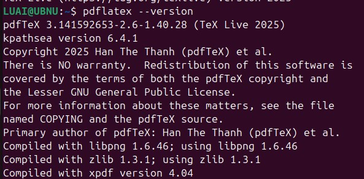

---
# Front matter
lang: ru-RU
title: "Лабораторная работа №1"
subtitle: "Дисциплина: Компьютерный практикум по научному письму"
author: "ДАБВАН ЛУАИ МОХАММЕД АЛИ"

# Formatting
toc-title: "Содержание"
toc: true # Table of contents
toc_depth: 2
lof: true # Список рисунков
lot: true # Список таблиц
fontsize: 12pt
linestretch: 1.5
papersize: a4paper
documentclass: scrreprt
polyglossia-lang: russian
polyglossia-otherlangs: english
mainfont: PT Serif
romanfont: PT Serif
sansfont: PT Sans
monofont: PT Mono
mainfontoptions: Ligatures=TeX
romanfontoptions: Ligatures=TeX
sansfontoptions: Ligatures=TeX,Scale=MatchLowercase
monofontoptions: Scale=MatchLowercase
indent: true
pdf-engine: lualatex
header-includes:
  - \linepenalty=10 # the penalty added to the badness of each line within a paragraph (no associated penalty node) Increasing the value makes tex try to have fewer lines in the paragraph.
  - \interlinepenalty=0 # value of the penalty (node) added after each line of a paragraph.
  - \hyphenpenalty=50 # the penalty for line breaking at an automatically inserted hyphen
  - \exhyphenpenalty=50 # the penalty for line breaking at an explicit hyphen
  - \binoppenalty=700 # the penalty for breaking a line at a binary operator
  - \relpenalty=500 # the penalty for breaking a line at a relation
  - \clubpenalty=150 # extra penalty for breaking after first line of a paragraph
  - \widowpenalty=150 # extra penalty for breaking before last line of a paragraph
  - \displaywidowpenalty=50 # extra penalty for breaking before last line before a display math
  - \brokenpenalty=100 # extra penalty for page breaking after a hyphenated line
  - \predisplaypenalty=10000 # penalty for breaking before a display
  - \postdisplaypenalty=0 # penalty for breaking after a display
  - \floatingpenalty = 20000 # penalty for splitting an insertion (can only be split footnote in standard LaTeX)
  - \raggedbottom # or \flushbottom
  - \usepackage{float} # keep figures where there are in the text
  - \floatplacement{figure}{H} # keep figures where there are in the text
---

# Цель работы

Познакомиться с основами работы в LaTeX и установкой дистрибутива TeXlive.

# Задание

1. Установить дистрибутив TeXlive.
2. Изучить общую информацию о TeXlive и способы его установки.

# Выполнение лабораторной работы

1. Изучение общей информации о TeXlive
TeX Live — это наиболее полный дистрибутив LaTeX, поддерживаемый сообществом TeX.

Поддерживает большое количество операционных систем.

Разрабатывается с 1996 года.

Основан на дистрибутиве teTeX.

MacTeX — вариант для MacOS.

Основная страница: https://www.tug.org/texlive/.

TeX Live — это дистрибутив с непрерывными обновлениями в рамках ежегодной версии.

2) Установка TeXlive
Были рассмотрены два способа установки:

 Установка с помощью пакетного менеджера
Для системы Ubuntu использовалась команда:

sudo apt install texlive-full

{ width=100% }

3) Обновление TeXlive

После установки TeXlive я проверил версию системы с помощью команды pdflatex --version. На экране терминала отобразилась информация о том, что установлена версия TeX Live 2025.

Поскольку это последняя доступная версия дистрибутива, необходимость в обновлении отсутствует. Система полностью готова к работе и не требует дополнительных действий по обновлению.

{ width=100% }

# Выводы

В ходе лабораторной работы была изучена базовая информация о дистрибутиве TeXlive и освоены основные способы его установки . Были получены знания о процессе обновления дистрибутива, что является важным для поддержания актуальной версии LaTeX.
