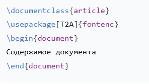
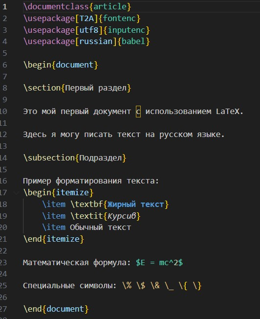

---
## Front matter
lang: ru-RU
title:  лабораторной работе №2
author: ДАБВАН ЛУАИ МОХАММЕД АЛИ
institute: РУДН, Москва, Россия

date: 25 Сентября 2025

## Formatting
toc: false
slide_level: 2
theme: metropolis
header-includes: 
 - \metroset{progressbar=frametitle,sectionpage=progressbar,numbering=fraction}
 - '\makeatletter'
 - '\beamer@ignorenonframefalse'
 - '\makeatother'
aspectratio: 43
section-titles: true
---

## Цель работы

Познакомиться со структурой LaTeX-документа и созданием простых документов.

## Задание

1. Изучить структуру LaTeX-документа

2. Создать документ с базовыми элементами

3. Освоить компиляцию документов

## Структура LaTeX-документа

Основные компоненты:

. Преамбула (настройки документа)

. Тело документа (содержимое)

. Команды и окружения

{ width=50% }

## Создание документа

Мои действия:

1. Создал файл document.tex

2. Написал код с разделами и форматированием

3. Добавил специальные символы и формулы

{ width=30% }

## Компиляция документа

Процесс компиляции:

. Открыл терминал в папке с файлом

. Выполнил команду:

{ width=50% }

## Результат работы
Полученный результат:

PDF-документ с корректной структурой

. Разделы и подразделы

. Форматированный текст

. Математическая формула

{ width=40% }

## Выводы

В ходе лабораторной работы была изучена базовая информация о дистрибутиве TeXlive и освоены основные способы его установки . Были получены знания о процессе обновления дистрибутива, что является важным для поддержания актуальной версии LaTeX.
