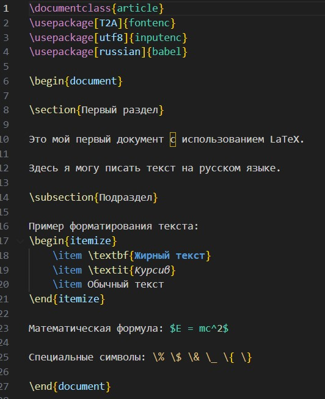
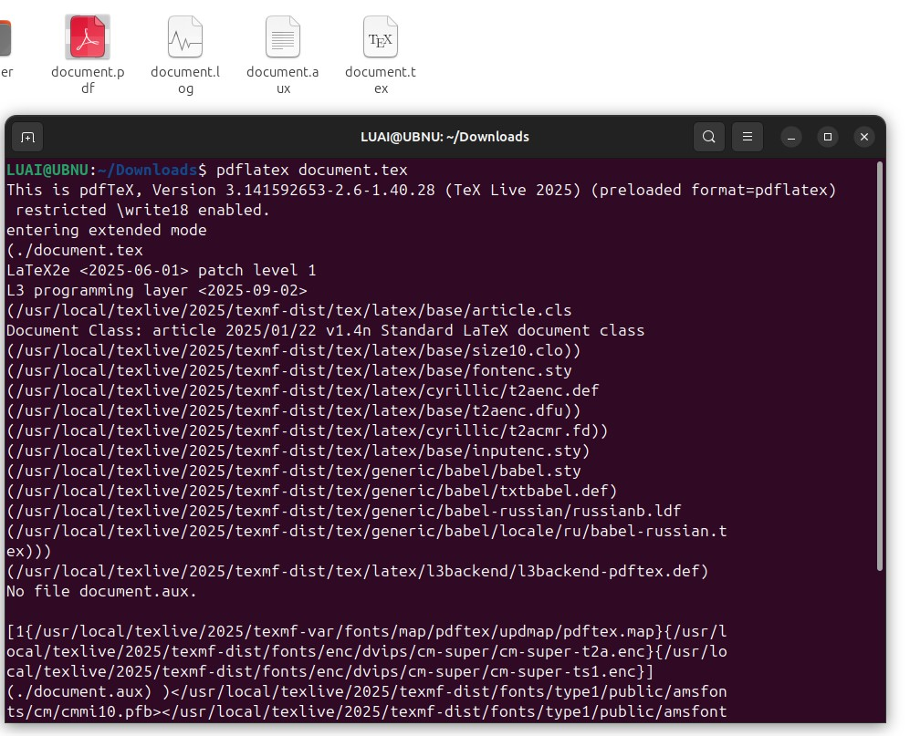
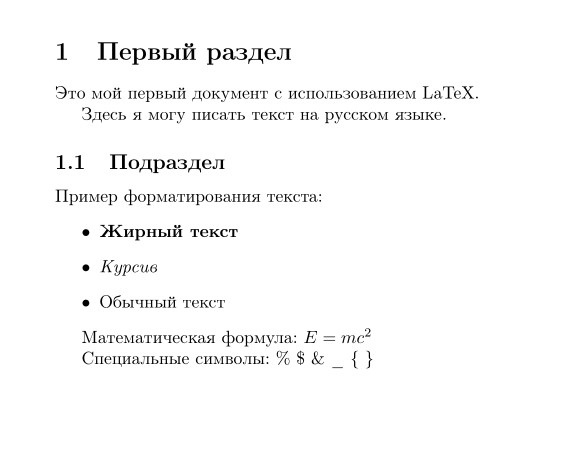

---
# Front matter
lang: ru-RU
title: "Лабораторная работа №2"
subtitle: "Дисциплина: Компьютерный практикум по научному письму"
author: "ДАБВАН ЛУАИ МОХАММЕД АЛИ"

# Formatting
toc-title: "Содержание"
toc: true # Table of contents
toc_depth: 2
lof: true # Список рисунков
lot: true # Список таблиц
fontsize: 12pt
linestretch: 1.5
papersize: a4paper
documentclass: scrreprt
polyglossia-lang: russian
polyglossia-otherlangs: english
mainfont: PT Serif
romanfont: PT Serif
sansfont: PT Sans
monofont: PT Mono
mainfontoptions: Ligatures=TeX
romanfontoptions: Ligatures=TeX
sansfontoptions: Ligatures=TeX,Scale=MatchLowercase
monofontoptions: Scale=MatchLowercase
indent: true
pdf-engine: lualatex
header-includes:
  - \linepenalty=10 # the penalty added to the badness of each line within a paragraph (no associated penalty node) Increasing the value makes tex try to have fewer lines in the paragraph.
  - \interlinepenalty=0 # value of the penalty (node) added after each line of a paragraph.
  - \hyphenpenalty=50 # the penalty for line breaking at an automatically inserted hyphen
  - \exhyphenpenalty=50 # the penalty for line breaking at an explicit hyphen
  - \binoppenalty=700 # the penalty for breaking a line at a binary operator
  - \relpenalty=500 # the penalty for breaking a line at a relation
  - \clubpenalty=150 # extra penalty for breaking after first line of a paragraph
  - \widowpenalty=150 # extra penalty for breaking before last line of a paragraph
  - \displaywidowpenalty=50 # extra penalty for breaking before last line before a display math
  - \brokenpenalty=100 # extra penalty for page breaking after a hyphenated line
  - \predisplaypenalty=10000 # penalty for breaking before a display
  - \postdisplaypenalty=0 # penalty for breaking after a display
  - \floatingpenalty = 20000 # penalty for splitting an insertion (can only be split footnote in standard LaTeX)
  - \raggedbottom # or \flushbottom
  - \usepackage{float} # keep figures where there are in the text
  - \floatplacement{figure}{H} # keep figures where there are in the text
---

# Цель работы

Познакомиться со структурой LaTeX-документа и созданием простых документов.

# Задание

1. Изучить структуру LaTeX-документа

2. Создать простой документ с базовыми элементами

3. Освоить основные команды и окружения LaTeX

# Выполнение лабораторной работы

1. Изучение структуры LaTeX-документа
Изучил базовую структуру LaTeX-документа, которая состоит из:

Преамбулы (настройки документа)

Тела документа (содержимое)

2. Создание простого документа
Создал файл document.tex со следующим содержимым:

{ width=50% }

3) Компиляция документа

Выполнил компиляцию документа командой:

pdflatex document.tex

В результате получен PDF-документ с корректной структурой разделов.

4) Добавление базовых элементов

.Добавил в документ различные элементы:

. Разделы и подразделы

. Форматирование текста (\textbf, \textit)

. Списки (itemize, enumerate)

# Пример добавления изображений

{ width=70% }

{ width=70% }

# Выводы

В ходе лабораторной работы была изучена структура LaTeX-документа и освоены основные принципы создания документов. Были получены практические навыки работы с разделами, подразделами и базовым форматированием текста. Созданный документ успешно скомпилирован в PDF-формат.