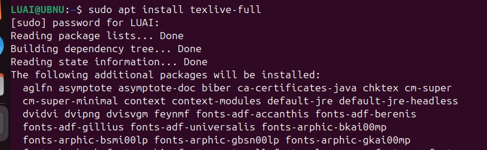
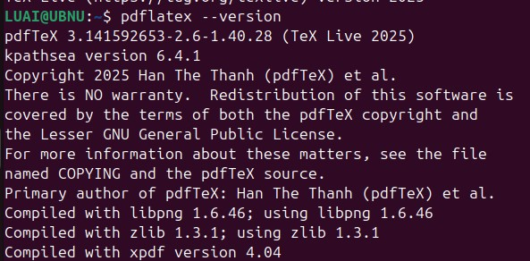

---
## Front matter
lang: ru-RU
title:  лабораторной работе №1
author: ДАБВАН ЛУАИ МОХАММЕД АЛИ
institute: РУДН, Москва, Россия

date: 25 Сентября 2025

## Formatting
toc: false
slide_level: 2
theme: metropolis
header-includes: 
 - \metroset{progressbar=frametitle,sectionpage=progressbar,numbering=fraction}
 - '\makeatletter'
 - '\beamer@ignorenonframefalse'
 - '\makeatother'
aspectratio: 43
section-titles: true
---

## Цель работы

1. Познакомиться с основами работы в LaTeX.
2. Освоить установку дистрибутива TeXliveЮ.

## Общая информация о TeXlive

- TeX Live — наиболее полный дистрибутив LaTeX

- Поддерживает множество операционных систем

- Разрабатывается с 1996 года

- Основная страница: https://www.tug.org/texlive/

- TeX Live — дистрибутив с непрерывными обновлениями

## Установка TeXlive

- Я выполнил установку TeXlive через пакетный менеджер apt в системе Ubuntu. Для этого я открыл терминал и ввел команду установки полной версии TeXlive. После подтверждения установки система автоматически загрузила и установила все необходимые пакеты. Процесс занял approximately 3 часа. 

{ width=100% }

## Проверка актуальности версии

- После установки TeXlive я проверил версию системы с помощью команды pdflatex --version. На экране терминала отобразилась информация о том, что установлена версия TeX Live 2025.
- Поскольку это последняя доступная версия дистрибутива, необходимость в обновлении отсутствует. Система полностью готова к работе и не требует дополнительных действий по обновлению.

{ width=59% }

## Выводы

В ходе лабораторной работы была изучена базовая информация о дистрибутиве TeXlive и освоены основные способы его установки . Были получены знания о процессе обновления дистрибутива, что является важным для поддержания актуальной версии LaTeX.
