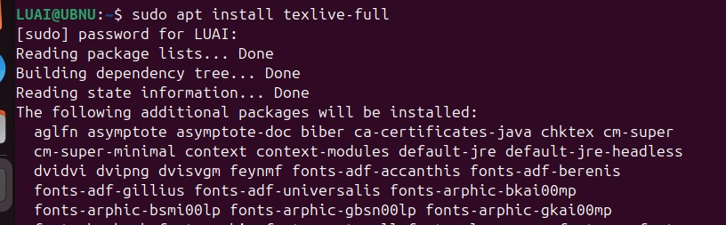
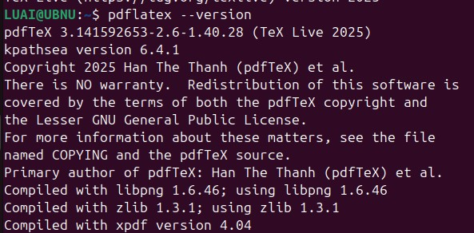

---
# Front matter
lang: ru-RU
title: "Лабораторная работа №1"
subtitle: "Дисциплина: Компьютерный практикум по научному письму"
author: "ДАБВАН ЛУАИ МОХАММЕД АЛИ"

## Generic otions
lang: ru-RU
toc-title: "Содержание"

## Bibliography
bibliography: bib/cite.bib
csl: pandoc/csl/gost-r-7-0-5-2008-numeric.csl

## Pdf output format
toc: true # Table of contents
toc-depth: 2
lof: true # List of figures
lot: false # List of tables
fontsize: 12pt
linestretch: 1.5
papersize: a4
documentclass: scrreprt
## I18n polyglossia
polyglossia-lang:
  name: russian
  options:
	- spelling=modern
	- babelshorthands=true
polyglossia-otherlangs:
  name: english
## I18n babel
babel-lang: russian
babel-otherlangs: english
## Fonts
mainfont: IBM Plex Serif
romanfont: IBM Plex Serif
sansfont: IBM Plex Sans
monofont: IBM Plex Mono
mathfont: Latin Modern Math
mainfontoptions: Ligatures=Common,Ligatures=TeX,Scale=0.94
romanfontoptions: Ligatures=Common,Ligatures=TeX,Scale=0.94
sansfontoptions: Ligatures=Common,Ligatures=TeX,Scale=MatchLowercase,Scale=0.94
monofontoptions: Scale=MatchLowercase,Scale=0.94,FakeStretch=0.9
mathfontoptions:
## Biblatex
biblatex: true
biblio-style: "gost-numeric"
biblatexoptions:
  - parentracker=true
  - backend=biber
  - hyperref=auto
  - language=auto
  - autolang=other*
  - citestyle=gost-numeric
## Pandoc-crossref LaTeX customization
figureTitle: "Рис."
tableTitle: "Таблица"
listingTitle: "Листинг"
lofTitle: "Список иллюстраций"
lotTitle: "Список таблиц"
lolTitle: "Листинги"
## Misc options
indent: true
header-includes:
  - \usepackage{indentfirst}
  - \usepackage{float} # keep figures where there are in the text
  - \floatplacement{figure}{H} # keep figures where there are in the text
---

# Цель работы

Познакомиться с основами работы в LaTeX и установкой дистрибутива TeXlive[@lab-task; @texlive-install].

# Задание

1. Установить дистрибутив TeXlive.
2. Изучить общую информацию о TeXlive и способы его установки.

# Выполнение лабораторной работы

1. Изучение общей информации о TeXlive
TeX Live — это наиболее полный дистрибутив LaTeX, поддерживаемый сообществом TeX.

Поддерживает большое количество операционных систем.

Разрабатывается с 1996 года.

Основан на дистрибутиве teTeX.

MacTeX — вариант для MacOS.

Основная страница: https://www.tug.org/texlive/.

TeX Live — это дистрибутив с непрерывными обновлениями в рамках ежегодной версии.

2) Установка TeXlive
Были рассмотрены два способа установки:

 Установка с помощью пакетного менеджера
Для системы Ubuntu использовалась команда:

sudo apt install texlive-full

{ width=100% }

3) Обновление TeXlive

После установки TeXlive я проверил версию системы с помощью команды pdflatex --version. На экране терминала отобразилась информация о том, что установлена версия TeX Live 2025.

Поскольку это последняя доступная версия дистрибутива, необходимость в обновлении отсутствует. Система полностью готова к работе и не требует дополнительных действий по обновлению.

{ width=100% }

# Выводы

В ходе лабораторной работы была изучена базовая информация о дистрибутиве TeXlive и освоены основные способы его установки . Были получены знания о процессе обновления дистрибутива, что является важным для поддержания актуальной версии LaTeX.

# Список литературы{.unnumbered}
