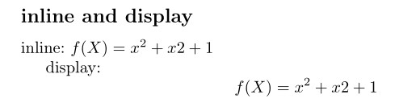
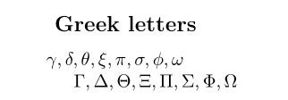
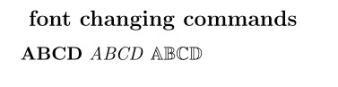
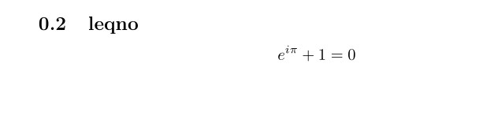

---
## Front matter
title: "Отчёт по лабораторной работе №3: Математика Mathematics Typing"
subtitle: "Дисциплина: Компьютерный практикум по научному письму"
author: "ДАБВАН ЛУАИ МОХАММЕД АЛИ"

## Generic otions
lang: ru-RU
toc-title: "Содержание"

## Bibliography
bibliography: bib/cite.bib
csl: pandoc/csl/gost-r-7-0-5-2008-numeric.csl

## Pdf output format
toc: true # Table of contents
toc-depth: 2
lof: true # List of figures
lot: false # List of tables
fontsize: 12pt
linestretch: 1.5
papersize: a4
documentclass: scrreprt
## I18n polyglossia
polyglossia-lang:
  name: russian
  options:
	- spelling=modern
	- babelshorthands=true
polyglossia-otherlangs:
  name: english
## I18n babel
babel-lang: russian
babel-otherlangs: english
## Fonts
mainfont: IBM Plex Serif
romanfont: IBM Plex Serif
sansfont: IBM Plex Sans
monofont: IBM Plex Mono
monofont: IBM Plex Mono
mainfontoptions: Ligatures=Common,Ligatures=TeX,Scale=0.94
romanfontoptions: Ligatures=Common,Ligatures=TeX,Scale=0.94
sansfontoptions: Ligatures=Common,Ligatures=TeX,Scale=MatchLowercase,Scale=0.94
monofontoptions: Scale=MatchLowercase,Scale=0.94,FakeStretch=0.9
mathfontoptions:
## Biblatex
biblatex: true
biblio-style: "gost-numeric"
biblatexoptions:
  - parentracker=true
  - backend=biber
  - hyperref=auto
  - language=auto
  - autolang=other*
  - citestyle=gost-numeric
## Pandoc-crossref LaTeX customization
figureTitle: "Рис."
tableTitle: "Таблица"
listingTitle: "Листинг"
lofTitle: "Список иллюстраций"
lotTitle: "Список таблиц"
lolTitle: "Листинги"
## Misc options
indent: true
header-includes:
  - \usepackage{indentfirst}
  - \usepackage{float} # keep figures where there are in the text
  - \floatplacement{figure}{H} # keep figures where there are in the text
---

# Общая информация о задании лабораторной работы

## Цель работы
Освоение раздела "Mathematics Typing" системы LaTeX, изучение математических режимов, основных команд для работы с математическими выражениями и выполнение практического упражнения 3.8 из руководства[@lab-task; @overleaf-math].

## Задание
1. Изучить математические режимы LaTeX

2. Освоить набор основных математических выражений

3. Изучить использование греческих букв и специальных символов

4. Освоить работу с матрицами и системами уравнений

5. Выполнить упражнение 3.8 из практического руководства


## Теоретическая часть


### Математические режимы в LaTeX
LaTeX предоставляет два основных режима для набора математических формул:

- Инлайн-режим: формулы внутри текста, обозначаются $...$

- Выделенный режим: формулы на отдельной строке, обозначаются \[...\]

## Основные математические команды
- Греческие буквы: ```latex \alpha, \beta, \gamma, \Gamma, \Delta ```

- Дроби: ```latex \frac{числитель}{знаменатель}```

- Индексы: верхние ^, нижние _

- Интегралы: \int, суммы: \sum, произведения: \prod


## Пакет amsmath
Пакет amsmath предоставляет расширенные возможности для работы с математическими выражениями:

- Окружения для матриц

- Системы уравнений

- Многострочные формулы

- Специальные математические символы


# Выполнение лабораторной работы упражнения 3.8
## Задание 1: Сравнение инлайн и выделенного режима
 

```latex
inline: $ f(X) = x^2 + x2 + 1$

display: 
\[
f(X) = x^2 + x2 + 1
\]
```

### Результат Задание 1

{width=70%}

## Задание 2: Греческие буквы


```latex
\subsection*{ Greek letters}
$\gamma, \delta, \theta, \xi, \pi, \sigma, \phi, \omega$

$\Gamma, \Delta, \Theta, \Xi, \Pi, \Sigma, \Phi, \Omega$
```

### Результат адание 2: Греческие буквы


{width=70%}

## Задание 3: Команды изменения шрифтов


```latex

\subsection*{ font changing commands}
$\mathrm{\mathbf{ABCD}}$
$\mathbf{\mathit{ABCD}}$
$\mathsf{\mathbb{ABCD}}$
```

### Результат адание 3: Команды изменения шрифтов


{width=70%}


## Задание 4: Опция [fleqn]


```latex

\subsection{fleqn}
 \[
 \int_a^b f(x)\,dx = F(b) - F(a)
 \]
$\mathsf{\mathbb{ABCD}}$

```

### Результат адание 4: Опция [fleqn]


{width=70%}


## Задание 5: Опция [leqno]


```latex
\subsection{leqno}
\begin{equation}
e^{i\pi} + 1 = 0
\end{equation}
```

### Результат адание 4: Опция [fleqn]

{width=70%}


# Выводы

В ходе выполнения лабораторной работы и упражнения 3.8 были изучены и практически опробованы различные аспекты работы с математическими формулами в LaTeX. Освоены инлайн и выделенный математические режимы, изучены греческие буквы и команды изменения шрифтов. Практически исследовано влияние опций документа [fleqn] и [leqno] на форматирование математических выражений. Приобретены навыки работы с сложными математическими структурами и их корректного отображения в PDF-документах.

# Список литературы{.unnumbered}
