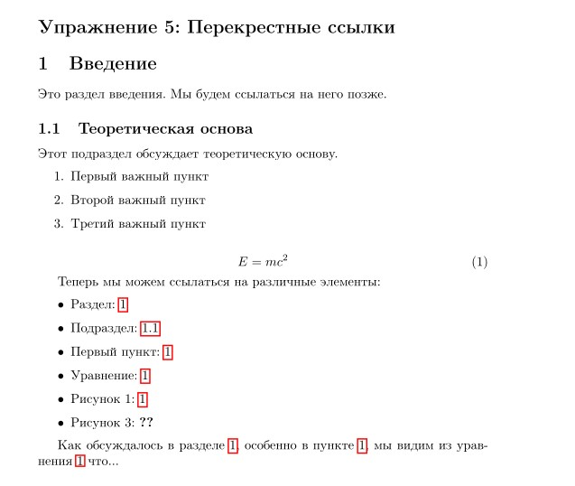

---
## Front matter
title: "Отчёт по лабораторной работе №4: Вставка изображений"
subtitle: "Дисциплина: Компьютерный практикум по научному письму"
author: "ДАБВАН ЛУАИ МОХАММЕД АЛИ"

## Generic otions
lang: ru-RU
toc-title: "Содержание"

## Bibliography
bibliography: bib/cite.bib
csl: pandoc/csl/gost-r-7-0-5-2008-numeric.csl

## Pdf output format
toc: true # Table of contents
toc-depth: 2
lof: true # List of figures
lot: false # List of tables
fontsize: 12pt
linestretch: 1.5
papersize: a4
documentclass: scrreprt
## I18n polyglossia
polyglossia-lang:
  name: russian
  options:
	- spelling=modern
	- babelshorthands=true
polyglossia-otherlangs:
  name: english
## I18n babel
babel-lang: russian
babel-otherlangs: english
## Fonts
mainfont: IBM Plex Serif
romanfont: IBM Plex Serif
sansfont: IBM Plex Sans
monofont: IBM Plex Mono
mathfont: STIX Two Math
mainfontoptions: Ligatures=Common,Ligatures=TeX,Scale=0.94
romanfontoptions: Ligatures=Common,Ligatures=TeX,Scale=0.94
sansfontoptions: Ligatures=Common,Ligatures=TeX,Scale=MatchLowercase,Scale=0.94
monofontoptions: Scale=MatchLowercase,Scale=0.94,FakeStretch=0.9
mathfontoptions:
## Biblatex
biblatex: true
biblio-style: "gost-numeric"
biblatexoptions:
  - parentracker=true
  - backend=biber
  - hyperref=auto
  - language=auto
  - autolang=other*
  - citestyle=gost-numeric
## Pandoc-crossref LaTeX customization
figureTitle: "Рис."
tableTitle: "Таблица"
listingTitle: "Листинг"
lofTitle: "Список иллюстраций"
lotTitle: "Список таблиц"
lolTitle: "Листинги"
## Misc options
indent: true
header-includes:
  - \usepackage{indentfirst}
  - \usepackage{float} # keep figures where there are in the text
  - \floatplacement{figure}{H} # keep figures where there are in the text
---


# Вводная часть

### Актуальность темы:

Использование изображений является важным элементом научных публикаций и презентаций. Пакет graphicx в LaTeX обеспечивает гибкое управление графикой, её масштабированием, обрезкой и позиционированием.

### Объект исследования:

Документы, подготовленные с использованием LaTeX.

### Предмет исследования:
Методы включения и форматирования графических элементов в LaTeX.

### Научная новизна:
Систематизация способов управления графическими элементами и анализ возможностей пакета graphicx в контексте научной работы.

### Практическая значимость:
Позволяет создавать профессионально оформленные отчёты, статьи и диссертации с корректным размещением изображений.


# Цель работы , задачи и гипотеза

## Цель исследования:
Изучить методы вставки изображений в LaTeX с помощью пакета graphicx

## Гипотеза:
 Использование команд LaTeX для вставки изображений позволяет добиться профессионального качества оформления научных документов.

## Задачи исследования:

1. Ознакомиться с основными командами \includegraphics и параметрами (width, height, scale, angle).

2. Изучить способы позиционирования изображений с помощью среды figure.

3. Рассмотреть методы обрезки и масштабирования графики.

4. Освоить кросс-ссылки на рисунки и автоматическую нумерацию.

5. Выполнить упражнение 4.9 из практического руководства


## Материалы и методы 
- Пакет: graphicx

- Среда: figure

- Дополнительные инструменты: float, trivfloat, hyperref

- Теоретическая база: раздел 4 книги Practical Scientific Writing


# Содержание исследования

## 1.Предлагаемое решение задач исследования с обоснованием


Для решения поставленных задач исследования была выбрана система вёрстки LaTeX и пакет graphicx, предоставляющий широкий набор инструментов для работы с графикой.
Основная идея заключалась в интеграции графических элементов в научный текст без потери качества изображения и с сохранением логической структуры документа.

Использование пакета graphicx позволяет:

- вставлять изображения различных форматов (PDF, PNG, JPG, EPS);

- управлять их размерами, масштабом и ориентацией при помощи параметров width, height, scale, angle;

- размещать изображения в виде «плавающих объектов» с подписями и нумерацией (figure);

- создавать перекрёстные ссылки (\label и \ref), что обеспечивает автоматическую нумерацию и удобную навигацию по документу.

Обоснование выбора данного подхода связано с его гибкостью, универсальностью и соответствием академическим стандартам оформления научных публикаций.


## 2.Основные этапы работы

### пражнение 1. Вставить собственное изображение.

```latex 

\section*{Упражнение 1: Включение изображений}
\begin{figure}[H]
\centering
\includegraphics[width=0.3\textwidth]{image.jpg}
\caption{Мое изображение}
\label{fig:myimage}
\end{figure}

```
### Результат: 

{width=70%}


### Упражнение 2. Использование параметров height, width, angle, scale
мы изучили влияние параметров изменения размера и угла поворота изображения.

```latex 

\section*{Упражнение 2: Параметры изображений}

\begin{center}
\includegraphics[height=2cm]{image.jpg}
\includegraphics[width=0.2\textwidth]{image.jpg}
\includegraphics[scale=0.6]{image.jpg}
\includegraphics[angle=45, width=0.15\textwidth]{image.jpg}
\end{center}

```

### Результат: 

{width=70%} 


### Упражнение 3. Сравнение ```latex   \textwidth и \linewidth ``` с опцией twocolumn

``` Использовать ключ width для задания размеров двух изображений —
одно относительно \textwidth, другое относительно \linewidth.
Затем проверить, как они ведут себя в обычном режиме 
и при включении параметра twocolumn.
``` 
```latex 

\clearpage
\twocolumn

\section*{Упражнение 3: Сравнение \textbackslash textwidth и \textbackslash linewidth}

\begin{figure}[h!]
\centering
\includegraphics[width=0.8\textwidth]{image.jpg}
\includegraphics[width=0.8\linewidth]{image.jpg}
\caption{Сравнение textwidth и linewidth в режиме двух колонок}
\end{figure}

\onecolumn
\clearpage


\begin{figure}[h!]
\centering
\includegraphics[width=0.8\textwidth]{image.jpg}
\includegraphics[width=0.8\linewidth]{image.jpg}
\caption{В одноколоночном режиме}
\end{figure}

```

### Результат: 

{width=40%} {width=40%} 

]

### Упражнение 4. Использование lipsum и размещение плавающих объектов
мы создаали длинный текст с помощью пакета lipsum и протестировать размещение изображений с разными позиционными параметрами [h], [t], [b], [p].

```latex 

\newpage


\section*{Упражнение 4: Работа с плавающими объектами}

\lipsum[1-2]

\begin{figure}[H]
\centering
\includegraphics[width=0.3\textwidth]{image.jpg}
\caption{Рисунок с [H] - точно здесь}
\label{fig:here}
\end{figure}

\lipsum[3]

\begin{figure}[H]
\centering
\includegraphics[width=0.3\textwidth]{image.jpg}
\caption{Рисунок в текущем месте}
\label{fig:current}
\end{figure}


\lipsum[4]

\begin{figure}[t]
\centering
\includegraphics[width=0.4\textwidth]{image.jpg}
\caption{Рисунок с [t] - верх страницы}
\label{fig:top}
\end{figure}

\begin{figure}[b]
\centering
\includegraphics[width=0.4\textwidth]{image.jpg}
\caption{Рисунок с [b] - низ страницы}
\label{fig:bottom}
\end{figure}

\clearpage


```

### Результат:

{width=50%}{width=50%}


### Упражнение 5. Добавление нумерованных разделов и проверка количества прогонов LaTeX

мы добавили в тестовый документ новые нумерованные элементы — разделы (\section), подразделы (\subsection) и нумерованные списки (enumerate) — и определить, сколько компиляций (runs) LaTeX требуется для корректного обновления всех ссылок, создаваемых с помощью команды \label.

```latex 

\section*{Упражнение 5: Перекрестные ссылки}

\section{Введение}
\label{sec:intro}

Это раздел введения. Мы будем ссылаться на него позже.

\subsection{Теоретическая основа}
\label{subsec:background}

Этот подраздел обсуждает теоретическую основу.

\begin{enumerate}
    \item \label{item:first} Первый важный пункт
    \item \label{item:second} Второй важный пункт
    \item \label{item:third} Третий важный пункт
\end{enumerate}

\begin{equation}
\label{eq:simple}
E = mc^2
\end{equation}

Теперь мы можем ссылаться на различные элементы:

\begin{itemize}
    \item Раздел: \ref{sec:intro}
    \item Подраздел: \ref{subsec:background}
    \item Первый пункт: \ref{item:first}
    \item Уравнение: \ref{eq:simple}
    \item Рисунок 1: \ref{fig:myimage}
    \item Рисунок 3: \ref{fig:linewidth}
\end{itemize}

Как обсуждалось в разделе~\ref{sec:intro}, особенно в пункте~\ref{item:first}, мы видим из уравнения~\ref{eq:simple} что...
```


### Результат:

{width=70%} 

### Упражнение 6. Проверка работы \label после \end{equation}

мы проверили, что произойдёт, если команду \label поставить после \end{equation}.

eq:energy}
```latex 
\section*{Упражнение 6: Метки уравнений}

\begin{equation}
E = mc^2
\label{eq:energy}
\end{equation}

\begin{equation}
E = mc^2
\end{equation}
\label{eq:energy}
```

### Результат:

{width=80%} 


# Анализ и практическая значимость достигнутых результатов
В ходе выполнения практической работы по теме «Including Graphics» были проведены серии упражнений, направленных на изучение инструментов LaTeX для работы с графикой, нумерацией и перекрёстными ссылками.

## Анализ полученных результатов показывает следующее:

Гибкость системы.
Пакет graphicx обеспечивает широкие возможности управления изображениями — масштабирование, вращение, обрезку и позиционирование без потери качества.

Точность позиционирования.
Использование параметров ``` \textwidth и \linewidth``` демонстрирует разницу в поведении графических объектов в одно- и двухколоночных макетах, что имеет практическое значение при подготовке статей и отчётов в формате журнала.

Контроль плавающих объектов.
Изучение модификаторов [h], [t], [b], [H] показало, что LaTeX способен автоматически размещать графику оптимальным образом, сохраняя читаемость текста.

Система перекрёстных ссылок.
Анализ показал, что для корректной работы \label и \ref необходимо не менее двух прогонов LaTeX. Это подтверждает важность понимания механизма компиляции.


## Практическая значимость работы заключается в том, что освоенные методы позволяют:

грамотно оформлять научные публикации, диссертации и отчёты;

повышать визуальную наглядность материалов за счёт интеграции графики;

избегать ошибок при нумерации и ссылках, что важно при подготовке больших документов.


# Выводы по проделанной работе


LaTeX остаётся надёжной и универсальной системой для подготовки научных документов высокого качества.

Грамотное использование графики способствует лучшему восприятию данных и повышает академический уровень оформления публикаций.

Полученные навыки можно применять при написании научных статей, дипломных и проектных работ, а также при подготовке отчётов и презентаций.


# Список литературы{.unnumbered}
