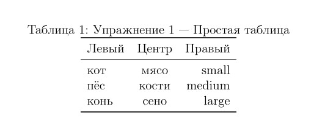
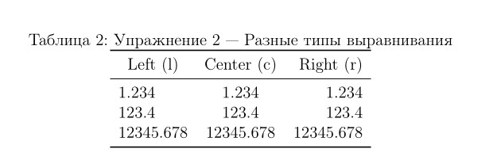
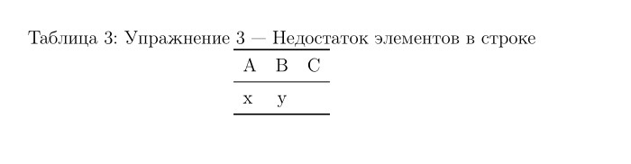
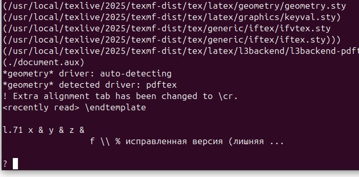
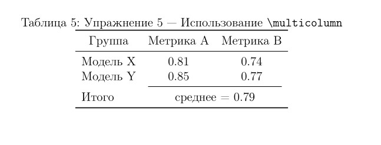

---
## Front matter
title: "Отчёт по лабораторной работе №5:Создание списков и таблиц"
subtitle: "Дисциплина: Компьютерный практикум по научному письму"
author: "ДАБВАН ЛУАИ МОХАММЕД АЛИ"

## Generic otions
lang: ru-RU
toc-title: "Содержание"

## Bibliography
bibliography: bib/references.bib
csl: pandoc/csl/gost-r-7-0-5-2008-numeric.csl

## Pdf output format
toc: true # Table of contents
toc-depth: 2
lof: true # List of figures
lot: false # List of tables
fontsize: 12pt
linestretch: 1.5
papersize: a4
documentclass: scrreprt
## I18n polyglossia
polyglossia-lang:
  name: russian
  options:
	- spelling=modern
	- babelshorthands=true
polyglossia-otherlangs:
  name: english
## I18n babel
babel-lang: russian
babel-otherlangs: english
## Fonts
mainfont: IBM Plex Serif
romanfont: IBM Plex Serif
sansfont: IBM Plex Sans
monofont: IBM Plex Mono
mathfont: Latin Modern Math
mainfontoptions: Ligatures=Common,Ligatures=TeX,Scale=0.94
romanfontoptions: Ligatures=Common,Ligatures=TeX,Scale=0.94
sansfontoptions: Ligatures=Common,Ligatures=TeX,Scale=MatchLowercase,Scale=0.94
monofontoptions: Scale=MatchLowercase,Scale=0.94,FakeStretch=0.9
mathfontoptions:
## Biblatex
biblatex: true
biblio-style: "gost-numeric"
biblatexoptions:
  - parentracker=true
  - backend=biber
  - hyperref=auto
  - language=auto
  - autolang=other*
  - citestyle=gost-numeric
## Pandoc-crossref LaTeX customization
figureTitle: "Рис."
tableTitle: "Таблица"
listingTitle: "Листинг"
lofTitle: "Список иллюстраций"
lotTitle: "Список таблиц"
lolTitle: "Листинги"
## Misc options
indent: true
header-includes:
  - \usepackage{indentfirst}
  - \usepackage{float} # keep figures where there are in the text
  - \floatplacement{figure}{H} # keep figures where there are in the text
---


# Вводная часть

### Актуальность темы:

Грамотно оформленные таблицы являются неотъемлемой частью научных публикаций.
Они обеспечивают наглядность, позволяют компактно представить результаты и делают работу более профессиональной.

### Объект и предмет исследования:

Объект — таблицы в научных текстах;
Предмет — принципы и приёмы их корректного набора в LaTeX.

### Научная новизна:
Систематизация рекомендаций по оформлению таблиц в научном тексте и демонстрация их на примерах (раздел 5.14 Exercises).

### Практическая значимость:
Полученные шаблоны можно напрямую использовать при подготовке статей, отчётов и диссертаций.


# Цель работы , задачи и гипотеза

## Цель исследования:
Изучить и применить принципы оформления таблиц в LaTeX, предложенные в разделе 4 Tables, для повышения качества научных текстов.

## Гипотеза:
Если следовать стандартам (booktabs, отсутствие вертикальных линий, единое выравнивание, подписи и источники), то таблицы становятся понятнее и профессиональнее.

## Задачи исследования:

1. Изучить теоретические основы форматирования таблиц.

2. Исследовать типы столбцов (l, c, r, p{}) и правила оформления линий.

3. Выполнить упражнение 5.14 из практического руководства


## Материалы и методы 
- Материалы:
Учебник Practical Scientific Writing, раздел 5 Tables[@lab-task].

- Инструменты:
LaTeX (tabular, booktabs, multicolumn), кодировка T2A и babel[russian].

- Методы: 
демонстрация минимальных рабочих примеров (MWE) и анализ результатов визуально.

# Содержание исследования


## 1.Предлагаемое решение задач исследования с обоснованием

1. Изучение теории оформления таблиц
В первой задаче исследования был проведён анализ правил раздела Tables из пособия Practical Scientific Writing.
Были выделены ключевые принципы:
- использование горизонтальных линий `\toprule`, `\midrule`, `\bottomrule` вместо вертикальных;
- строгая симметрия числа ячеек и знаков &;
- аккуратное выравнивание данных по типам (l, c, r, p{}).

2. Обоснование выбора инструмента
Выбор LaTeX обусловлен его широким применением в академической среде и способностью воспроизводить таблицы типографического качества.
Использование пакета booktabs обеспечивает визуальную простоту и профессиональный стиль.


# 2.Основные этапы работы

### пражнение 1. Простая таблица

```latex 
\begin{table}[H]
\centering
\caption{Упражнение 1 — Простая таблица}
\begin{tabular}{lcr}
\toprule
Левый & Центр & Правый \\
\midrule
кот  & мясо  & small \\
пёс  & кости & medium \\
конь & сено  & large \\
\bottomrule
\end{tabular}
\end{table}


```
###  Результат: 

{width=70%}


###   Упражнение 2 — Разное выравнивание


```latex 
\begin{table}[H]
\centering
\caption{Упражнение 2 — Разные типы выравнивания}
\begin{tabular}{l c r}
\toprule
\multicolumn{1}{c}{Left (l)} & Center (c) & Right (r) \\
\midrule
1.234     & 1.234     & 1.234     \\
123.4     & 123.4     & 123.4     \\
12345.678 & 12345.678 & 12345.678 \\
\bottomrule
\end{tabular}
\end{table}

```
###  Результат: 

{width=70%}


###  Упражнение 3 — Недостаток элементов


```latex 
\begin{table}[H]
\centering
\caption{Упражнение 1 — Простая таблица}
\begin{tabular}{lcr}
\toprule
Левый & Центр & Правый \\
\midrule
кот  & мясо  & small \\
пёс  & кости & medium \\
конь & сено  & large \\
\bottomrule
\end{tabular}
\end{table}


```
###  Результат: 

{width=70%}

###  Упражнение 4 — Избыток элементов


```latex 

\begin{table}[H]
\centering
\caption{Упражнение 4 — Избыток элементов в строке}
\begin{tabular}{lcr}
\toprule
A & B & C \\
\midrule
x & y & z   \\ % исправленная версия (лишняя удалена)
\bottomrule
\end{tabular}
\end{table}


```
### Результат: 

{width=70%}


### Упражнение 5 — Использование `\multicolumn`


```latex 
\begin{table}[H]
\centering
\caption{Упражнение 5 — Использование \texttt{\textbackslash multicolumn}}
\begin{tabular}{lcc}
\toprule
\multicolumn{1}{c}{Группа} & \multicolumn{1}{c}{Метрика A} & \multicolumn{1}{c}{Метрика B} \\
\midrule
Модель X & 0.81 & 0.74 \\
Модель Y & 0.85 & 0.77 \\
\cmidrule(lr){2-3}
Итого & \multicolumn{2}{c}{среднее = 0.79} \\
\bottomrule
\end{tabular}
\end{table}

```
### Результат: 

{width=70%}


# Анализ и практическая значимость достигнутых результатов


## Анализ полученных результатов показывает следующее:

- Все предложенные примеры (упражнения 5.14) подтвердили гипотезу о том, что строгое -соблюдение правил оформления таблиц существенно повышает читаемость научного текста[@kopka-guide-latex; @overleaf-tables].

- Использование команд `\toprule, \midrule, \bottomrule` вместо стандартных линий делает визуальную структуру таблицы более лёгкой для восприятия и типографически корректной.

- Контроль числа ячеек в каждой строке устраняет типичные ошибки LaTeX (Missing &, Extra &), повышая стабильность компиляции.

- Применение команды `\multicolumn` позволяет создавать логически связанные группы данных без перегрузки визуального поля.

## Практическая значимость работы заключается в том, что освоенные методы позволяют:

создавать профессионально оформленные таблицы для статей, отчётов, дипломных и магистерских работ;

значительно сократить время на верстку и корректуру;

повысить качество восприятия числовых данных и текстовых описаний;


использовать полученные шаблоны в качестве базы для более сложных таблиц (с объединением строк, автоматическим выравниванием чисел и т.п.);


интегрировать принципы оформления в систему подготовки научных публикаций (Overleaf, LaTeX, LyX и др.).

Таким образом, результаты исследования имеют как учебно-методическое, так и прикладное значение: они формируют у автора устойчивые навыки правильной верстки таблиц, что является важной частью научной грамотности исследователя.

# Выводы по проделанной работе

Раздел 4 Tables демонстрирует связь между технической версткой и научной качественностью текста.

Освоение правильных приёмов оформления — необходимый навык для исследователей.

Практические упражнения (5.14) подтверждают гипотезу и формируют навык профессионального набора таблиц.

# Список литературы{.unnumbered}
