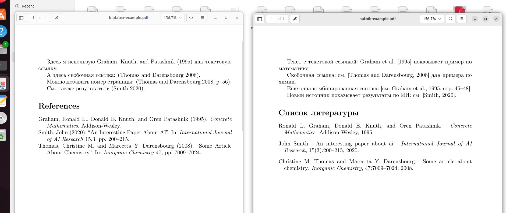
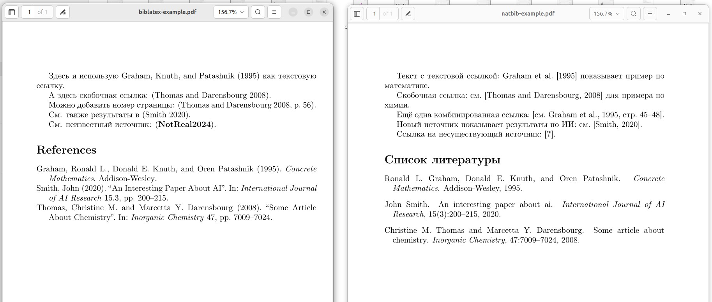
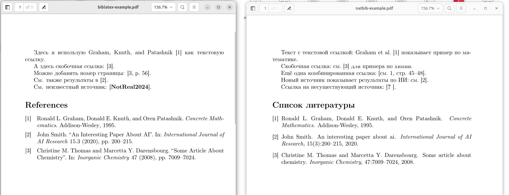

---
## Front matter
title: "Отчёт по лабораторной работе №6: Работа с библиографией "
subtitle: "Дисциплина: Компьютерный практикум по научному письму"
author: "ДАБВАН ЛУАИ МОХАММЕД АЛИ"

## Generic otions
lang: ru-RU
toc-title: "Содержание"

# Bibliography
bibliography: bib/cite.bib
csl: pandoc/csl/gost-r-7-0-5-2008-numeric.csl

## Pdf output format
toc: true # Table of contents
toc-depth: 2
lof: true # List of figures
lot: false # List of tables
fontsize: 12pt
linestretch: 1.5
papersize: a4
documentclass: scrreprt
## I18n polyglossia
polyglossia-lang:
  name: russian
  options:
	- spelling=modern
	- babelshorthands=true
polyglossia-otherlangs:
  name: english
## I18n babel
babel-lang: russian
babel-otherlangs: english
## Fonts
mainfont: IBM Plex Serif
romanfont: IBM Plex Serif
sansfont: IBM Plex Sans
monofont: IBM Plex Mono
mathfont: STIX Two Math
mainfontoptions: Ligatures=Common,Ligatures=TeX,Scale=0.94
romanfontoptions: Ligatures=Common,Ligatures=TeX,Scale=0.94
sansfontoptions: Ligatures=Common,Ligatures=TeX,Scale=MatchLowercase,Scale=0.94
monofontoptions: Scale=MatchLowercase,Scale=0.94,FakeStretch=0.9
mathfontoptions:
## Biblatex
biblatex: true
biblio-style: "gost-numeric"
biblatexoptions:
  - parentracker=true
  - backend=biber
  - hyperref=auto
  - language=auto
  - autolang=other*
  - citestyle=gost-numeric
## Pandoc-crossref LaTeX customization
figureTitle: "Рис."
tableTitle: "Таблица"
listingTitle: "Листинг"
lofTitle: "Список иллюстраций"
lotTitle: "Список таблиц"
lolTitle: "Листинги"
## Misc options
indent: true
header-includes:
  - \usepackage{indentfirst}
  - \usepackage{float} # keep figures where there are in the text
  - \floatplacement{figure}{H} # keep figures where there are in the text
---


# Вводная часть

### Актуальность темы:

Актуальность темы заключается в том, что правильное оформление ссылок и библиографии является обязательной частью любой научной работы. Использование систем natbib, biblatex и BibTeX позволяет автоматизировать этот процесс, избежать ошибок и привести работу к академическим стандартам[@lab-task].

### Объект и предмет исследования:

библиографические ссылки в научном тексте
работа с базой ссылок в формате BibTeX и подключение её к LaTeX-документу.

### Научная новизна:
работы для меня состоит в том, что я перешёл(ла) от «ручного» набора списка литературы к использованию автоматической системы BibTeX/Biber и пакетов natbib и biblatex.

### Практическая значимость:
полученные навыки можно применять в курсовых, ВКР и научных статьях, чтобы быстро менять стиль цитирования и не править каждый источник вручную.


# Цель работы , задачи и гипотеза

## Цель работы:

научиться создавать базу литературы в файле .bib и подключать её к LaTeX-документу двумя способами: через BibTeX + natbib и через biblatex + Biber.

## Гипотеза:

если использовать отдельную базу BibTeX и специальные пакеты для цитирования, то оформление литературы становится более точным, единообразным и легко настраивается под разные журнальные требования.

## Задачи работы:

1. Разобраться, что такое BibTeX-файл и какие поля он содержит.

2. Освоить базовый BibTeX-workflow с пакетом natbib.

3. Освоить workflow с пакетом biblatex и программой Biber.

4. Сравнить оба подхода и понять, в каких случаях что лучше использовать.

5. Выполнить упражнение  6.9  из практического руководства


## Материалы и методы 

В качестве теоретической базы использовался раздел «Working with bibliography» из пособия Practical scientific writing

### Основные инструменты:
- LaTeX (компиляция через pdflatex).

- BibTeX-файл *.bib как база данных ссылок.

- Пакет natbib и стиль plainnat для первого подхода.

- Пакет biblatex со стилем authoryear и программа Biber – для второго подхода.

- Дополнительно пакет hyperref для превращения DOI и URL в кликабельные ссылки

# Содержание исследования


## 1.Предлагаемое решение задач исследования с обоснованием

В ходе исследования было предложено решение, основанное на применении двух современных подходов к автоматическому оформлению библиографических ссылок в LaTeX:
(1) классического подхода natbib + BibTeX и
(2) современного подхода biblatex + Biber.

Первый подход позволяет использовать хорошо зарекомендовавшую себя систему BibTeX и основные форматы ссылок типа author–year и numeric.
Второй подход обеспечивает более гибкое и широкое управление стилями цитирования, поддержку Unicode, а также удобное форматирование списка литературы.

Обоснование выбора таких решений состоит в том, что обе технологии являются стандартом в академическом письме и используются большинством международных журналов. Сравнение двух подходов позволяет увидеть их особенности, преимущества и ограничения, что важно для дальнейшего применения в научных работах.


# 2.Основные этапы работы
[@overleaf-bibliography].

### Создание базы библиографических записей (myrefs.bib).

В файл были внесены описания нескольких источников в формате BibTeX: книга, статья, и дополнительная новая запись.

```latex 
@book{Graham1995,
  author  = {Ronald L. Graham and Donald E. Knuth and Oren Patashnik},
  title   = {Concrete Mathematics},
  year    = {1995},
  publisher = {Addison-Wesley},}
@article{Thomas2008,
  author  = {Christine M. Thomas and Marcetta Y. Darensbourg},
  title   = {Some Article About Chemistry},
  journal = {Inorganic Chemistry},
  year    = {2008},

  volume  = {47},
  pages   = {7009-7024},
}


```


### Реализация примера с использованием natbib и BibTeX

Был создан документ с текстовыми и скобочными ссылками, после чего выполнена полная цепочка компиляции:
pdflatex → bibtex → pdflatex → pdflatex.
Автоматически был сформирован раздел «Список литературы».


```latex 

\documentclass{article}
\usepackage[T1]{fontenc}
\usepackage[utf8]{inputenc}
\usepackage{natbib}
\begin{document}
Текст с текстовой ссылкой: \citet{Graham1995} показывает пример по математике.
Скобочная ссылка: см. \citep{Thomas2008} для примера по химии.
Ещё одна комбинированная ссылка: \citep[см.][стр.~45--48]{Graham1995}.
\bibliographystyle{plainnat}
\bibliography{myrefs}  % наш файл myrefs.bib
\end{document}


```
### Результат: 

{width=70%}


### Реализация примера с использованием biblatex и Biber.

Документ был адаптирован под biblatex, добавлен ресурс \addbibresource, использованы команды \textcite, \parencite, \autocite, и выполнена компиляция:
pdflatex → biber → pdflatex.
Автоматически появился раздел «References».


```latex 
\documentclass{article}
\usepackage[T1]{fontenc}
\usepackage[utf8]{inputenc}

\usepackage[style=authoryear]{biblatex}
\addbibresource{myrefs.bib}
\begin{document}


Здесь я использую \textcite{Graham1995} как текстовую ссылку.
А здесь скобочная ссылка: \parencite{Thomas2008}.
Можно добавить номер страницы: \autocite[56]{Thomas2008}.


\printbibliography
\end{document}


```
### Результат: 

{width=70%}


##  Добавление новой записи в базу и её цитирование

В myrefs.bib был добавлен новый источник (Smith, 2020) и интегрирован в оба примера. Система корректно вывела его в список литературы.

## Результат: 

{width=100%}


###  Тестирование ссылки на несуществующий источник

В документ было добавлено цитирование с ключом, которого нет в базе данных. Это привело к появлению предупреждения и знака «?» в тексте, что демонстрирует работу механизма проверки ссылок.


### Результат: 

{width=100%}


### Эксперимент с числовым стилем (numeric)

Для natbib была использована опция [numbers], а для biblatex — стиль style=numeric, что позволило сравнить оба варианта числовых ссылок.


### Результат: 

{width=100%}


# Анализ и практическая значимость достигнутых результатов


## Анализ полученных результатов показывает следующее:

- уменьшает количество ручных ошибок в оформлении;

- облегчает смену стиля ссылок при подготовке статьи в разные журналы;

- позволяет переиспользовать одну и ту же базу .bib в нескольких проектах.

## Практическая значимость работы заключается в том, что освоенные методы позволяют:

Практическая значимость работы заключается в том, что освоенные методы позволяют быстро собирать и оформлять список литературы, добавлять новые источники и менять стиль оформления без переписывания всего списка вручную.

# Выводы по проделанной работе

В ходе ЛР №6 я освоил базовые приёмы работы с библиографией в LaTeX: создание BibTeX-базы, подключение её через natbib и через biblatex, а также выбор стиля ссылок.

Сделанный эксперимент подтвердил гипотезу: использование специализированных пакетов и отдельной базы литературы делает оформление источников более удобным, гибким и соответствующим академическим стандартам.

# Список литературы{.unnumbered}
