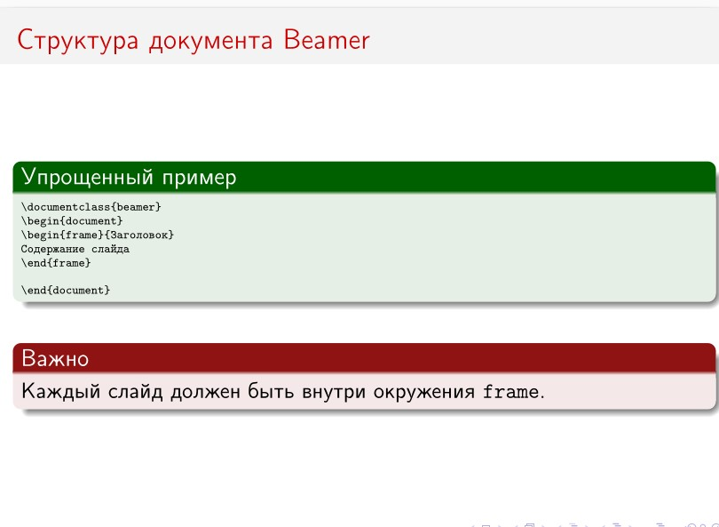
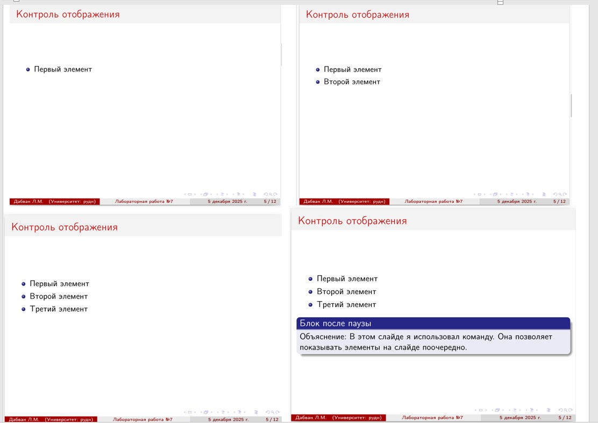
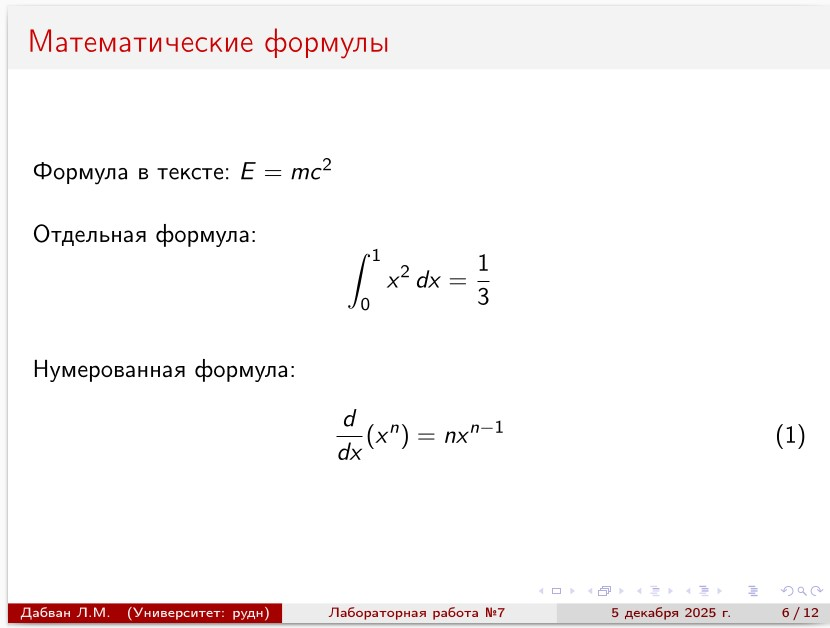
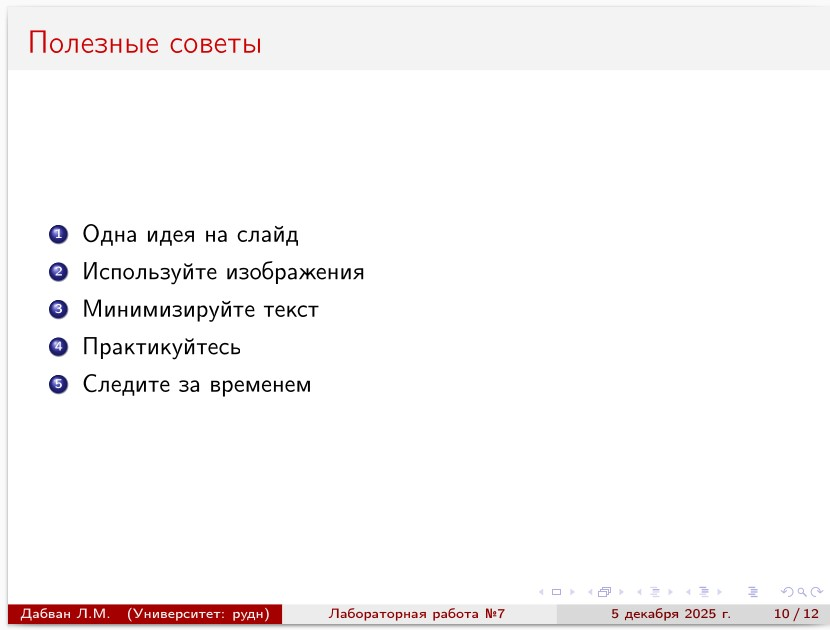

---
## Front matter
title: "Отчёт по лабораторной работе №7: Презентация на базе Beamer "
subtitle: "Дисциплина: Компьютерный практикум по научному письму"
author: "ДАБВАН ЛУАИ МОХАММЕД АЛИ"

## Generic otions
lang: ru-RU
toc-title: "Содержание"

## Bibliography
bibliography: bib/references.bib
csl: pandoc/csl/gost-r-7-0-5-2008-numeric.csl

## Pdf output format
toc: true # Table of contents
toc-depth: 2
lof: true # List of figures
lot: false # List of tables
fontsize: 12pt
linestretch: 1.5
papersize: a4
documentclass: scrreprt
## I18n polyglossia
polyglossia-lang:
  name: russian
  options:
	- spelling=modern
	- babelshorthands=true
polyglossia-otherlangs:
  name: english
## I18n babel
babel-lang: russian
babel-otherlangs: english
## Fonts
mainfont: IBM Plex Serif
romanfont: IBM Plex Serif
sansfont: IBM Plex Sans
monofont: IBM Plex Mono
mathfont: STIX Two Math
mainfontoptions: Ligatures=Common,Ligatures=TeX,Scale=0.94
romanfontoptions: Ligatures=Common,Ligatures=TeX,Scale=0.94
sansfontoptions: Ligatures=Common,Ligatures=TeX,Scale=MatchLowercase,Scale=0.94
monofontoptions: Scale=MatchLowercase,Scale=0.94,FakeStretch=0.9
mathfontoptions:
## Biblatex
biblatex: true
biblio-style: "gost-numeric"
biblatexoptions:
  - parentracker=true
  - backend=biber
  - hyperref=auto
  - language=auto
  - autolang=other*
  - citestyle=gost-numeric
## Pandoc-crossref LaTeX customization
figureTitle: "Рис."
tableTitle: "Таблица"
listingTitle: "Листинг"
lofTitle: "Список иллюстраций"
lotTitle: "Список таблиц"
lolTitle: "Листинги"
## Misc options
indent: true
header-includes:
  - \usepackage{indentfirst}
  - \usepackage{float} # keep figures where there are in the text
  - \floatplacement{figure}{H} # keep figures where there are in the text
---


# Вводная часть

### Актуальность темы:

В этом работа мы изучаем, как создать презентации с использованием Beamer в LaTeX. Это важная тема, потому что LaTeX является мощным инструментом для создания научных презентаций, которые требуют точности и профессионального оформления, особенно в математике и научных дисциплинах.

### Объект и предмет исследования:

Объект исследования: это использование Beamer для создания научных презентаций в LaTeX.
Предмет исследования: это методы, возможности и преимущества Beamer по сравнению с другими инструментами, такими как PowerPoint, для создания научных презентаций.

### Научная новизна:
Практическая значимость заключается в том, что использование Beamer в LaTeX значительно ускоряет процесс создания презентаций для научных конференций, лекций и других мероприятий, обеспечивая при этом высокий уровень качества и точности.
### Практическая значимость:
полученные навыки можно применять в курсовых, ВКР и научных статьях, чтобы быстро менять стиль цитирования и не править каждый источник вручную.


# Цель работы , задачи и гипотеза

## Цель работы:

Цель работы — изучить возможности использования Beamer в LaTeX для создания научных презентаций .
## Гипотеза:

Мы предполагаем, что использование Beamer для создания научных презентаций может быть более эффективным и удобным по сравнению с другими инструментами, такими как PowerPoint, благодаря его интеграции с LaTeX и возможностью создания профессиональных слайдов с математическими формулами и таблицами.

## Задачи работы:

1. Изучить основы Beamer и его функциональные возможности.

2. Создать пример научной презентации с использованием Beamer.

3. Оценить преимущества и недостатки Beamer на практике.


## Материалы и методы 

В качестве теоретической базы использовался раздел «LaTeX presentations» из пособия Practical scientific writing

### Основные инструменты:
- LaTeX (компиляция через pdflatex).

- BibTeX-файл *.bib как база данных ссылок.

- Пакет natbib и стиль plainnat для первого подхода.

- Пакет biblatex со стилем authoryear и программа Biber – для второго подхода.

- Дополнительно пакет hyperref для превращения DOI и URL в кликабельные ссылки

# Содержание исследования


## 1.Предлагаемое решение задач исследования с обоснованием

Решение задач исследования заключалось в использовании Beamer для создания научных презентаций. Это решение обосновано тем, что Beamer обеспечивает высокую точность в оформлении и позволяет автоматически организовывать слайды с необходимыми элементами, такими как формулы и изображения.


# 2.Основные этапы работы

### Создание Содержание


Мы используем команду \tableofcontents, чтобы автоматом отображать все разделы, главы и подразделы, которые будут показаны в презентации.

```latex 
\begin{frame}{Содержание}
\tableofcontents
\end{frame}
```

### Результат: 

{width=70%}


### Основная структура — Структура документа Beamer

```latex 
\section{Основная структура}
\begin{frame}{Структура документа Beamer}
\begin{exampleblock}{Упрощенный пример}

{\tiny
\texttt{\textbackslash documentclass\{beamer\}}\\
\texttt{\textbackslash begin\{document\}}\\
\texttt{\textbackslash begin\{frame\}\{Заголовок\}}\\

\texttt{Содержание слайда}\\
\texttt{\textbackslash end\{frame\}}\\
\texttt{\textbackslash end\{document\}}

}
\end{exampleblock}
\vspace{0.3cm}


\begin{alertblock}{Важно}
Каждый слайд должен быть внутри окружения \texttt{frame}.
\end{alertblock}

\end{frame}

```
### Результат: 

{width=70%}


###  Элементы управления — Контроль отображения

```latex 

\section{Элементы управления}

\begin{frame}{Контроль отображения}
\begin{itemize}
\item Первый элемент

\pause
\item Второй элемент
\pause
\item Третий элемент

\end{itemize}

\pause


\begin{block}{Блок после паузы}
Объяснение: В этом слайде я использовал команду. Она

позволяет показывать элементы на слайде поочередно.
\end{block}
\end{frame}


```
### Результат: 

{width=100%}


###  Математика — Математические формулы

```latex 


\section{Математика}

\begin{frame}{Математические формулы}

Формула в тексте: $E = mc^2$

\vspace{0.5cm}

Отдельная формула:

\[

\int_{0}^{1} x^2 \, dx = \frac{1}{3}

\]

\vspace{0.5cm}

Нумерованная формула:

\begin{equation}

\frac{d}{dx}(x^n) = n x^{n-1}

\end{equation}

\end{frame}

```

### Результат: 

{width=100%}


### Выровненные уравнения
```latex 


\begin{frame}{Выровненные уравнения}

\begin{align*}

f(x) &= x^2 + 2x + 1 \\


g(x) &= \sin(x) + \cos(x) \\

h(x) &= \frac{1}{1 + e^{-x}}

\end{align*}

\end{frame}

```

## Результат: 

{width=100%}


## Изображения  в презентациях


Мы используем команду \includegraphics, которая позволяет добавлять изображения в слайды с нужными размерами. Это помогает сделать презентацию более наглядной и привлекательной.
```latex 


\begin{frame}{Изображения в презентациях}

\begin{center}
\includegraphics[width=0.5\textwidth]{image_01.jpg}

\captionof{figure}{Пример изображения}

\end{center}

\end{frame}

```


## Результат: 

{width=100%}


##  таблицы  в презентациях
```latex 


\begin{frame}{Таблицы в Beamer}

\begin{center}

\begin{tabular}{lcc}

\toprule

Предмет & Количество & Цена \\

\midrule

Книги & 5 & 2500 руб. \\

Ручки & 10 & 500 руб. \\

Блокноты & 3 & 900 руб. \\

\bottomrule

\end{tabular}

\end{center}

\end{frame}


```


## Результат: 

{width=100%}


##  Советы — Полезные советы
```latex 


\section{Советы}
\begin{frame}{Полезные советы}

\begin{enumerate}

\item Одна идея на слайд

\item Используйте изображения

\item Минимизируйте текст

\item Практикуйтесь

\item Следите за временем

\end{enumerate}

\end{frame}


```

## Результат: 

{width=100%}


# Анализ и практическая значимость достигнутых результатов


## Анализ полученных результатов показывает следующее:

В результате работы было установлено, что Beamer предоставляет множество преимуществ для создания научных презентаций. Он позволяет создавать точные и профессионально оформленные слайды, что значительно ускоряет процесс подготовки.


## Практическая значимость работы заключается в том, что освоенные методы позволяют:

Практическая значимость работы заключается в том, что освоенные методы позволяют быстро собирать и оформлять список литературы, добавлять новые источники и менять стиль оформления без переписывания всего списка вручную.

# Выводы по проделанной работе

В рамках лабораторной работы №7 мы изучили процесс создания научных презентаций с использованием LaTeX и пакета Beamer. Работа включала в себя освоение основ Beamer, создание примеров презентаций, использование различных элементов (таких как блоки, списки, изображения, математические формулы и таблицы) .
